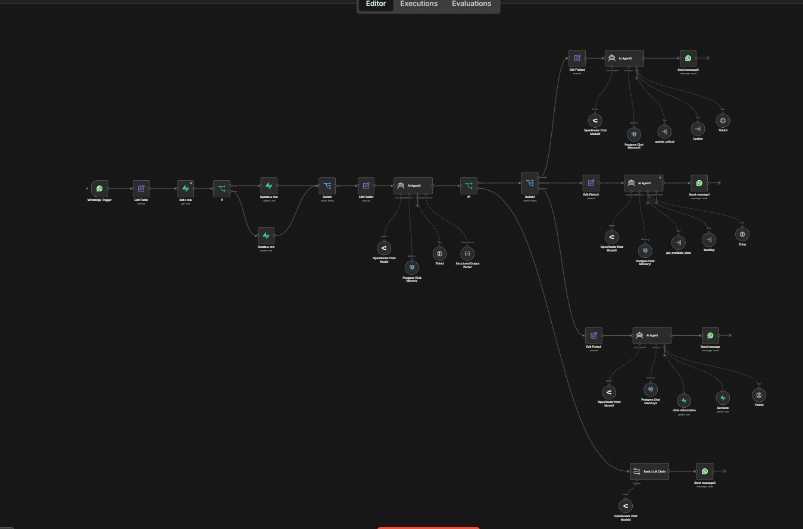
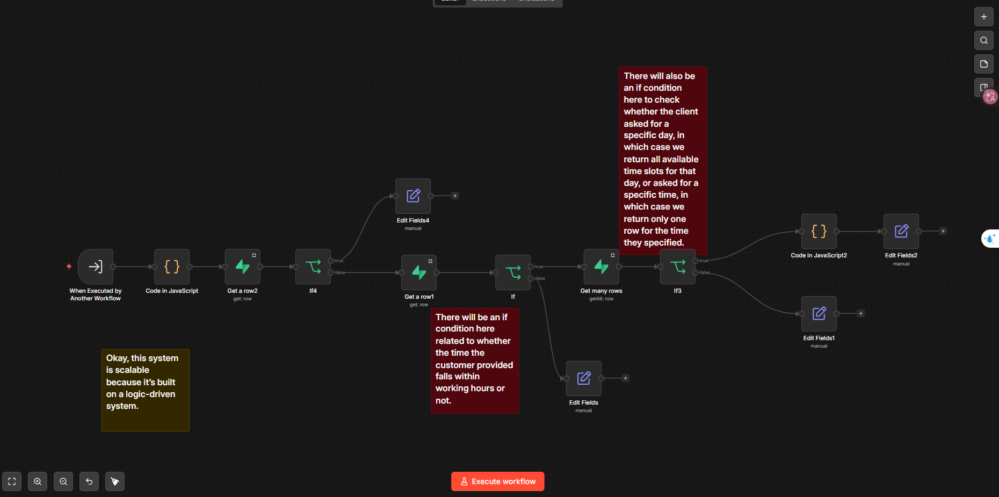
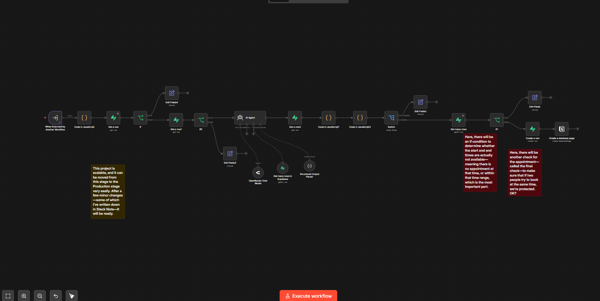
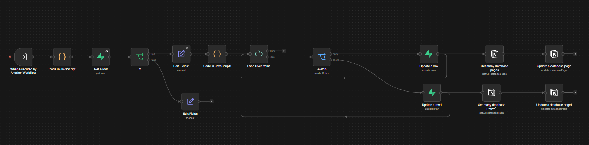
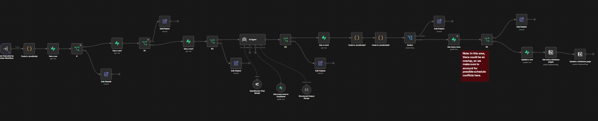
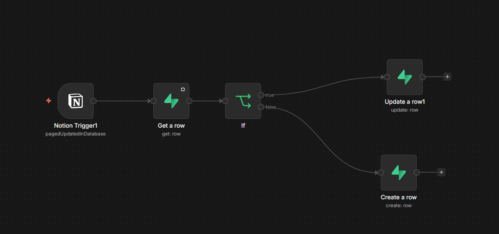
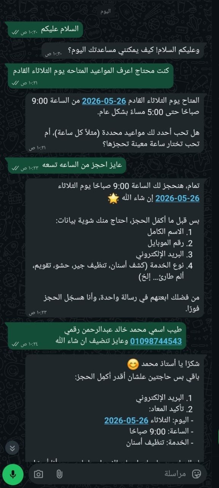
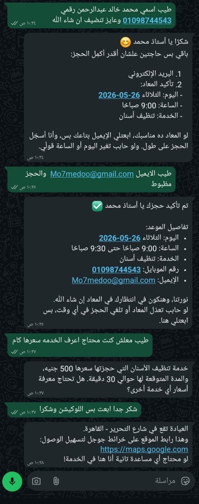

<div align="center">

<br/>


<br/><br/>
 

<br/>
 **A production-grade AI receptionist that handles clinic appointments end-to-end via WhatsApp — with zero human intervention.**
 
</div>
---
 
## 📌 What Is This?
 
The **AI Dental Clinic System** is a fully automated, intelligent clinic management system built on **n8n**. It acts as a smart AI receptionist that talks to patients via **WhatsApp**, understands their requests using AI, and handles the full appointment lifecycle — all synced in real time between **Supabase** (the database) and **Notion** (the staff dashboard).
 
No phone calls. No manual scheduling. No back-and-forth. Just a patient sending a WhatsApp message and getting their appointment confirmed automatically.
 
---
 
## 🏗️ System Architecture
 
```
WhatsApp Message
      │
      ▼
┌─────────────────────┐
│   n8n Main Router   │  ← Webhook trigger + customer tracking
└─────────┬───────────┘
          │
          ▼
┌─────────────────────┐
│  Intent Classifier  │  ← AI Agent (OpenRouter)
│  booking / modify / │     Confidence threshold: 90%
│  general / unclear  │
└─────────┬───────────┘
          │
    ┌─────┴──────────────────┐
    ▼         ▼              ▼
 Booking   Update         General
  Agent    Agent          Agent
    │         │              │
    ▼         ▼              ▼
Supabase  Supabase       Supabase
    │         │
    ▼         ▼
 Notion   Notion
  Sync     Sync
    │
    ▼
WhatsApp Response ← AI-formatted reply sent back to patient
```
 
---
 
## 🧠 AI Agents Breakdown
 
### 1. 🔀 Intent Classifier Agent
**File:** `ai-main-router.json`
 
The first AI brain in the system. Reads every incoming WhatsApp message and classifies it into one of 4 intents:
 
| Intent | Description | Example |
|---|---|---|
| `booking` | New appointment or checking available slots | "I want to book tomorrow at 3 PM" |
| `modify` | Change or reschedule existing appointment | "Move my appointment to Friday" |
| `general` | Clinic info, services, personal appointment lookup | "What are your working hours?" |
| `unclear` | Low confidence — triggers clarification message | Ambiguous or noisy input |
 
> Confidence threshold is **90%** — anything below triggers an automatic clarification request to the patient.
 
---
 
### 2. 📅 Booking Agent
**Files:** `booking-get-available-slots.json` + `booking-create-appointment.json`
 
**Stage 1 — Get Available Slots**
- Checks `clinic_exceptions` for holidays or closures
- Verifies the day is active in `clinic_schedule`
- Fetches all existing appointments for that date
- Runs a JavaScript algorithm to calculate all **free time gaps** between bookings
- Returns available slots to the AI agent
**Stage 2 — Create Appointment**
- Parses the customer's booking data (name, phone, email, date, time, service)
- Validates date against exceptions and schedule
- Uses an **AI sub-agent** to fuzzy-match the service name
- Calculates `end_time` based on service duration from Supabase
- Validates requested time is within working hours
- Checks for **slot conflicts** before writing
- Creates the appointment in **Supabase** → syncs to **Notion**
---
 
### 3. ✏️ Update Agent
**Files:** `booking-update-simple.json` + `booking-update-critical.json`
 
**Simple Update** — name or phone number only
- Loops over all requested field changes
- Updates Supabase and syncs to Notion
**Critical Update** — rescheduling or service change
- Verifies patient exists by phone number
- Checks new date against exceptions and schedule
- AI sub-agent validates the requested service
- Recalculates `end_time` based on new service duration
- Validates new time slot is within working hours
- Conflict check before committing
- Updates **Supabase** and **Notion** atomically
---
 
### 4. 💬 General Info Agent
**File:** `ai-main-router.json` (General branch)
 
Answers clinic-related questions by querying:
- `clinic_information` — location, working hours, general details
- `services` — service list, descriptions, pricing
Also handles personal appointment lookups when a patient asks "when is my appointment?"
 
---
 
## 📋 Workflow Map
 
| Workflow | Type | Purpose |
|---|---|---|
| `ai-main-router` | Main | Entry point, intent routing, customer tracking |
| `booking-get-available-slots` | Booking | Compute free time slots for a given date |
| `booking-create-appointment` | Booking | Full appointment creation with validation |
| `booking-update-simple` | Update | Update name or phone number |
| `booking-update-critical` | Update | Reschedule appointment or change service |
| `Patient Appointment Check` | Query | Look up personal appointment by phone |
| `sync-bookings-from-notion` | Sync | Notion → Supabase (appointment changes) |
| `sync-clinic-info-from-notion` | Sync | Notion → Supabase (clinic info updates) |
| `sync-clinic-schedule-from-notion` | Sync | Notion → Supabase (schedule changes) |
| `sync-exceptions-from-notion` | Sync | Notion → Supabase (holidays/exceptions) |
| `sync-services-from-notion` | Sync | Notion → Supabase (services/pricing) |
 
---
 
## 🛢️ Database Schema (Supabase)
 
```
appointments
  ├── id
  ├── customer_name
  ├── customer_phone
  ├── customer_email
  ├── appointment_date
  ├── start_time
  ├── end_time
  ├── Service
  └── status
 
clinic_schedule
  ├── notion_id
  ├── day_of_week
  ├── start_time
  ├── end_time
  └── active (bool)
 
clinic_exceptions
  ├── notion_id
  ├── exception_date
  ├── reason
  └── closed (bool)
 
services
  ├── notion_id
  ├── service_name
  ├── price
  ├── duration_minutes
  ├── description
  └── active (bool)
 
clinic_information
  ├── notion_id
  ├── info_key
  └── info_value
 
customers
  ├── customer_name
  ├── phone_number
  └── last_seen
```
 
---
 
## 🔄 Notion ↔ Supabase Sync
 
Staff manage everything from **Notion** — no technical skills required. Any change in Notion triggers a real-time sync to Supabase:
 
```
Notion Dashboard (Staff)
       │
       │  polling trigger (every 1–3 min)
       ▼
  n8n Sync Workflow
       │
       ├── Record exists in Supabase? → UPDATE
       └── Record is new?            → CREATE
```
 
**What staff can manage from Notion:**
- Clinic working hours per day
- Days off and public holidays
- Service catalog (name, price, duration)
- Clinic general information
- Appointment status updates
---
 
## ⚙️ Tech Stack
 
<div align="center">
| Layer | Technology |
|---|---|
| Workflow Engine | [n8n](https://n8n.io) |
| AI Models | OpenRouter (GPT-4o, GPT-5.1) |
| Database | [Supabase](https://supabase.com) (PostgreSQL) |
| Admin Dashboard | [Notion](https://notion.so) |
| Communication | WhatsApp Business API |
| Memory | PostgreSQL Chat Memory (per user session) |
| Scripting | JavaScript (Node.js inside n8n) |
 
</div>
---
 
## 🧩 Key Engineering Decisions
 
**1. Confidence-gated routing** — The intent classifier only routes if confidence > 90%. Below that, the system asks the patient to clarify. This prevents wrong routing.
 
**2. AI-powered service matching** — A dedicated AI sub-agent fuzzy-matches service names. "Teeth whitening", "تبييض الأسنان", and "whitening" all resolve to the same service record.
 
**3. Dual-write architecture** — Every write happens in Supabase first, then immediately syncs to Notion. Supabase is the source of truth; Notion is the staff interface.
 
**4. Per-user conversation memory** — Each patient's conversation history is stored in PostgreSQL, keyed by their WhatsApp number. Multi-turn conversations work naturally.
 
**5. Conflict detection before booking** — The system checks `start_time + end_time + appointment_date` for conflicts before committing any booking or update. Prevents double-booking under concurrent requests.
 
---
 
## 🚀 System Visuals
 
<h3>Main Router</h3>
 
<a href="../assets/main-router.png">
  
</a>
<br/><br/>
 
<h3>Booking Workflows</h3>
 
<table>
  <tr>
    <th align="center">Available Slots</th>
    <th align="center">Create Appointment</th>
  </tr>
  <tr>
    <td align="center">
      <a href="../assets/booking-get-available-slots.png">
        
      </a>
    </td>
    <td align="center">
      <a href="../assets/booking-create-appointment.png">
        
      </a>
    </td>
  </tr>
</table>
<br/>
<h3>Update Workflows</h3>
 
<table>
  <tr>
    <th align="center">Simple Update</th>
    <th align="center">Critical Update</th>
  </tr>
  <tr>
    <td align="center">
      <a href="../assets/booking-update-simple.png">
        
      </a>
    </td>
    <td align="center">
      <a href="../assets/booking-update-critical.png">
        
      </a>
    </td>
  </tr>
</table>
<br/>
<h3>Notion Sync Layer</h3>
 
<a href="../assets/sync-notion-clinic-update.png">
  
</a>
<br/><br/>
 
<h3>Live WhatsApp Conversations</h3>
 
<table>
  <tr>
    <th align="center">Conversation 1</th>
    <th align="center">Conversation 2</th>
  </tr>
  <tr>
    <td align="center">
      <a href="../assets/system-test-01-initial-chat.jpg">
        
      </a>
    </td>
    <td align="center">
      <a href="../assets/system-test-02-response-flow.jpg">
        
      </a>
    </td>
  </tr>
</table>
---
 
## 🛣️ Road to Full Production
 
The system architecture is already production-grade. What remains is a set of targeted improvements across four layers:
 
### 1. 🧠 Prompt Engineering
The current prompts are functional but can be made significantly more robust:
 
- **Stronger intent boundaries** — Add more edge-case examples to the classifier prompt to reduce misclassification on hybrid intents (e.g., "book + ask about price" in one message)
- **Doctor's communication policy** — Inject the clinic's specific tone, greeting style, and terminology into every agent prompt. For example: how the assistant should refer to the doctor, how to handle sensitive patient concerns, what to say when cancellations happen
- **Slot response formatting** — Standardize how the booking agent presents available times so the output is always clean and consistent regardless of how many slots exist
- **Fallback hardening** — Improve the unclear-intent fallback to ask a smarter clarifying question based on partial context rather than a generic "could you clarify?"
### 2. 🗄️ Data Layer
Currently running on **demo data** — structured exactly like production but with test records:
 
- Replace demo appointments, services, and clinic info with real clinic data in Supabase
- Populate Notion databases with the actual doctor's schedule, real services and pricing, actual working hours, and real exception dates (holidays, vacations)
- Add real `customer_email` handling if email confirmations are needed
> The architecture does not change at all — only the data changes. Everything else stays the same.
 
### 3. 🔐 Authentication & Confirmation
Two missing safety layers:
 
- **OTP / confirmation codes** — After a booking is created, send a confirmation code via WhatsApp. Patient must reply with the code to finalize. This prevents fake or accidental bookings
- **Cancellation policy enforcement** — Add a rule that patients can only cancel/reschedule X hours before the appointment, based on the doctor's policy
### 4. 📌 Workflow Accuracy Upgrades
Several improvements were identified during development (marked as sticky notes in the workflows):
 
- **Overlap detection improvement** — `booking-get-available-slots` currently returns slots based on exact start/end gaps. Adding a check for partial overlaps (e.g., a 30-min appointment that starts 15 min into a gap) would make the slot logic bulletproof
- **Specific time vs. full-day check** — When a patient asks "is 3 PM free?" vs. "what slots are available on Saturday?", the system currently handles both the same way. Splitting these into two separate paths would make responses faster and more precise
- **Race condition protection** — `booking-create-appointment` has a final conflict check, but under simultaneous requests a race condition is still theoretically possible. A database-level row lock or a short transaction window would eliminate this fully
---
 
## ⚠️ Current Limitations
 
- Running on demo data — swap to real clinic data to go live
- No OTP or booking confirmation code
- No appointment reminder system (24h before reminders via WhatsApp)
- Prompt layer not yet tuned to the doctor's specific communication style
---
 
## 🔧 Production Checklist
 
```
[ ] Replace demo data with real clinic data in Supabase + Notion
[ ] Tune agent prompts to match doctor's communication style
[ ] Add OTP confirmation flow after booking
[ ] Add cancellation policy enforcement (time window before appointment)
[ ] Split slot-check logic: full-day availability vs. specific time check
[ ] Add partial overlap detection in available-slots workflow
[ ] Host n8n on VPS or cloud (e.g., Railway, Render, or self-hosted)
[ ] Connect to live WhatsApp Business API number
[ ] Set up monitoring and error alerts for failed workflow executions
```
 
---
 
<div align="center">

**Built with intention.**
 
<br/><br/>
 
<a href="https://www.linkedin.com/in/omar-emad-99a919326/">
  
</a>
&nbsp;&nbsp;
<a href="https://github.com/gxxzvb1005-creator">
  
</a>
</div>
